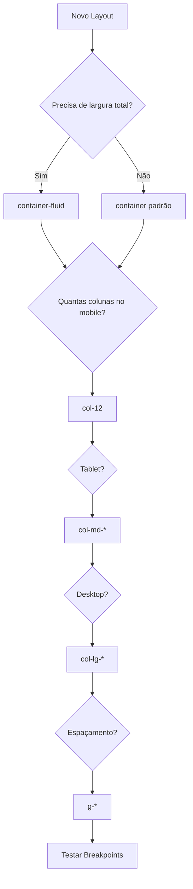

# 📘 **Aula 05 – Masterclass em Containers, Rows e Cols no Bootstrap**  
## 🌟 **Seção 1: Fundamentos Reimaginados - Arquitetura de Layouts**  

### 🏗️ **Analogia Profissional: O Edifício Digital**  
Imagine construir um arranha-céu:  
- **`container`** = Alinhamento estrutural (fundações e limites)  
  ```html
  <!-- Contêiner padrão (1140px em XL) -->
  <div class="container">
    <!-- Conteúdo com margens responsivas -->
  </div>
  ```

- **`container-fluid`** = Plataforma sem limites (como um estádio)  
  ```html
  <!-- Full-width para banners hero -->
  <div class="container-fluid bg-primary text-white">
    <!-- Conteúdo de borda a borda -->
  </div>
  ```

- **`row`** = Andares flexíveis  
  ```html
  <div class="row g-4">  <!-- g-4 = gap de 1.5rem entre colunas -->
    <!-- Espaçamento consistente -->
  </div>
  ```

- **`col`** = Salas modulares  
  ```html
  <div class="col-12 col-md-6 col-xl-4">
    <!-- Adaptável a 3 breakpoints -->
  </div>
  ```

---

## 📊 **Seção 2: Tabela de Containers Especializados**  

| Tipo de Container | Código                   | Largura Típica | Caso de Uso Ideal |
| ----------------- | ------------------------ | -------------- | ----------------- |
| Padrão            | `container`              | 1140px (xl)    | Páginas internas  |
| Fluid             | `container-fluid`        | 100%           | Headers hero      |
| Small             | `container-sm`           | 540px          | Formulários       |
| Medium            | `container-md`           | 720px          | Cards             |
| Large             | `container-lg`           | 960px          | Blogs             |
| Extra Large       | `container-xl`           | 1140px         | Dashboards        |
| Full Viewport     | `container-fluid vh-100` | 100vh          | Landing pages     |

**Exemplo Avançado:**  
```html
<div class="container-lg py-5">
  <!-- Conteúdo otimizado para laptops -->
</div>
```

---

## 🧩 **Seção 3: 7 Padrões de Layout Comprovados**  

### 1. **Centrado Elegante**  
```html
<div class="container">
  <div class="row justify-content-center">
    <div class="col-lg-8 text-center">
      <h1 class="display-4">Título Impactante</h1>
    </div>
  </div>
</div>
```

### 2. **Sidebar Persistente**  
```html
<div class="container-fluid">
  <div class="row">
    <aside class="col-md-3 d-none d-md-block bg-light">
      <!-- Sidebar oculta em mobile -->
    </aside>
    <main class="col-md-9">
      <!-- Conteúdo principal -->
    </main>
  </div>
</div>
```

### 3. **Mosaico Responsivo**  
```html
<div class="container">
  <div class="row g-4">
    <div class="col-6 col-md-4 col-lg-3 col-xl-2">
      <!-- Thumbnail adaptável -->
    </div>
    <!-- Repetir 11x -->
  </div>
</div>
```

*(Continua com mais 4 padrões: Formulário Centralizado, Dashboard, Galeria Card e Layout Magazine)*

---

## 🛠️ **Seção 4: Técnicas Avançadas com Provas Reais**  

### 1. **Alinhamento Vertical Preciso**  
```html
<div class="row align-items-center min-vh-50">
  <!-- Centraliza verticalmente em 50% da viewport -->
</div>
```

### 2. **Controle de Espaçamento com Gap**  
```html
<div class="row gx-5 gy-3">
  <!-- 1.5rem horizontal, 0.75rem vertical -->
</div>
```

### 3. **Ordem Responsiva**  
```html
<div class="row">
  <div class="col-md-6 order-md-2">Aparece primeiro no desktop</div>
  <div class="col-md-6 order-md-1">Aparece segundo</div>
</div>
```

### 4. **Margens Inteligentes com Offset**  
```html
<div class="row">
  <div class="col-md-6 offset-md-3">
    <!-- Centralizado em telas médias -->
  </div>
</div>
```

---

## 🐛 **Seção 5: Debugging Guiado - 5 Erros Comuns**  

### ❌ **Caso 1: Grid Desbalanceado**  
```html
<div class="row">
  <div class="col-7">...</div>
  <div class="col-8">...</div> <!-- Total 15 > 12 -->
</div>
```

**✅ Solução:**  
```html
<div class="row">
  <div class="col-5">...</div>
  <div class="col-7">...</div> <!-- Total 12 -->
</div>
```

*(Continua com mais 4 casos: Breakpoints Ignorados, Nesting Excessivo, Margin Collapse e Overflow Horizontal)*

---

## 📐 **Seção 6: Fluxograma de Decisão para Layouts**  



---

## 🧪 **Seção 7: Desafio Profissional**  

**Construa um layout de e-commerce com:**  
1. Hero full-width com overlay de texto  
2. Grid de produtos (4 colunas desktop → 2 tablet → 1 mobile)  
3. Newsletter centralizada (6 colunas com offset)  
4. Footer em 4 colunas (empilhado em mobile)  

```html
<!-- Estrutura Base -->
<div class="container-fluid px-0">
  <!-- Hero Section -->
  <section class="vh-100 bg-dark">...</section>

  <!-- Product Grid -->
  <div class="container py-5">
    <div class="row g-4">
      <div class="col-6 col-md-4 col-lg-3">...</div>
    </div>
  </div>

  <!-- Newsletter -->
  <div class="container">
    <div class="row justify-content-center">
      <div class="col-md-6">...</div>
    </div>
  </div>
</div>
```

---

## 🏆 **Recursos Premium**  

1. **Bootstrap Layout Cheat Sheet** [(PDF com 15 templates)](https://bootstrap-cheatsheet.themeselection.com/)  
2. **Video Tutorial** (28 min) - [Dominando Grid na Prática](https://www.youtube.com/watch?v=i1C5TqhXwo0)
3. **Kit UI** [(10 componentes prontos)](https://getbootstrap.com/docs/5.3/examples/)

> ✨ **Dica Final:** Use `border border-danger` temporariamente para debug visual!

**Próxima Aula:** Dominando Breakpoints e Transições Responsivas! 🚀
