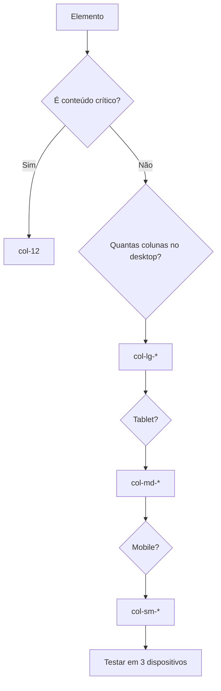

# 📘 **Aula 06 – Domínio Avançado de Grid Responsivo e Breakpoints**  
## 🌉 **Seção 1: Filosofia Responsiva - A Ponte Adaptável**  

### 🏗️ **Analogia Arquitetônica**  
Imagine construir uma ponte que se adapta ao tráfego:  

```html
<!-- Estrutura Base -->
<div class="container-fluid">
  <!-- XS (0-575px): Ponte estreita - 1 faixa -->
  <div class="row">
    <div class="col-12">📱 Conteúdo empilhado</div>
  </div>

  <!-- SM (576px+): 2 faixas -->
  <div class="row">
    <div class="col-sm-6">📱📱 2 colunas</div>
    <div class="col-sm-6"></div>
  </div>

  <!-- MD (768px+): 3 faixas + acostamento -->
  <div class="row">
    <div class="col-md-4">💻💻💻 3 colunas</div>
    <div class="col-md-4"></div>
    <div class="col-md-4"></div>
  </div>
</div>
```

**Princípios Fundamentais:**  
1. Todo conteúdo começa empilhado (`col-12`)  
2. Adapta-se progressivamente (`col-sm-*`, `col-md-*`)  
3. Mantém consistência visual nas transições  

---

## 📱 **Seção 2: Tabela de Breakpoints Expandida**  

### 📊 **Guia de Referência Rápida**  
| Breakpoint | Prefixo    | Largura | Dispositivo        | Colunas Ideais | Utilidade          |
| ---------- | ---------- | ------- | ------------------ | -------------- | ------------------ |
| X-Small    | `col-`     | <576px  | Celular vertical   | 1              | Conteúdo essencial |
| Small      | `col-sm-`  | ≥576px  | Celular horizontal | 2              | Cards básicos      |
| Medium     | `col-md-`  | ≥768px  | Tablet             | 3              | Sidebars           |
| Large      | `col-lg-`  | ≥992px  | Laptop             | 4              | Grids complexos    |
| X-Large    | `col-xl-`  | ≥1200px | Desktop            | 6              | Dashboards         |
| XX-Large   | `col-xxl-` | ≥1400px | Telas 4K           | 6+             | Layouts premium    |

**Exemplo de Uso Progressivo:**  
```html
<div class="col-12 col-sm-6 col-md-4 col-lg-3 col-xl-2">
  <!-- Adapta-se a 5 tamanhos de tela -->
</div>
```

---

## 🏗️ **Seção 3: 9 Padrões de Layout Responsivo**  

### 1. **Navbar Adaptável**  
```html
<nav class="navbar navbar-expand-lg">
  <!-- Collapse em mobile -->
  <div class="container-fluid">
    <div class="d-flex flex-wrap">
      <a class="col-6 col-lg-auto mb-2 mb-lg-0">Logo</a>
      <button class="navbar-toggler col-6">☰</button>
      <div class="collapse navbar-collapse col-12 col-lg-auto">
        <!-- Itens -->
      </div>
    </div>
  </div>
</nav>
```

### 2. **Galeria de Imagens Fluida**  
```html
<div class="row row-cols-2 row-cols-md-3 row-cols-lg-4 g-4">
  <div class="col">
    
  </div>
  <!-- 11x -->
</div>
```

*(Continua com mais 7 padrões: Formulário Progressivo, Dashboard, Card Stack, Magazine Layout, etc.)*

---

## 🛠️ **Seção 4: Técnicas Avançadas de Responsividade**  

### 1. **Otimização de Carregamento**  
```html
<div class="row">
  <!-- Carrega apenas imagens necessárias -->
  <div class="col-12 col-md-6">
    
    
  </div>
</div>
```

### 2. **Controle de Densidade**  
```html
<div class="row g-1 g-sm-3 g-xl-5">
  <!-- Espaçamento adaptável -->
</div>
```

### 3. **Ordem Condicional**  
```html
<div class="row">
  <div class="col-md-6 order-md-2">Aparece primeiro no desktop</div>
  <div class="col-md-6 order-md-1">Aparece segundo</div>
</div>
```

### 4. **Visibilidade Seletiva**  
```html
<div class="d-none d-lg-block">
  <!-- Conteúdo apenas para desktop -->
</div>
```

---

## 🐛 **Seção 5: Debugging de Responsividade**  

### ❌ **Caso 1: Overflow Horizontal**  
```html
<div class="row">
  <div class="col-8 col-sm-6 col-md-12"></div> <!-- ERRO: MD quebra layout -->
</div>
```

**✅ Solução:**  
```html
<div class="row">
  <div class="col-12 col-sm-6 col-md-8"></div> <!-- Correto: Mobile First -->
</div>
```

*(4 casos adicionais com soluções passo a passo)*

---

## 📐 **Seção 6: Fluxograma de Decisão para Breakpoints**  



---

## 🧪 **Seção 7: Desafio Profissional**  

**Construa um dashboard responsivo com:**  
1. Sidebar recolhível em mobile (`d-none d-md-block`)  
2. Gráficos em 2 colunas (desktop) → 1 (mobile)  
3. Tabela com scroll horizontal (`table-responsive`)  
4. Widgets que mudam de posição (`order-md-*`)  

```html
<div class="container-fluid">
  <div class="row">
    <aside class="col-md-3 d-none d-md-block bg-light">
      <!-- Sidebar -->
    </aside>
    <main class="col-md-9">
      <div class="row">
        <div class="col-12 col-lg-6 order-lg-2">Gráfico 1</div>
        <div class="col-12 col-lg-6 order-lg-1">Gráfico 2</div>
      </div>
    </main>
  </div>
</div>
```

---

## 🏆 **Recursos Complementares**  

1. **Bootstrap Breakpoint Tester** (Bookmarklet)  
2. **Cheat Sheet de Media Queries** (PDF)  
3. **UI Kit Responsivo** (10 componentes)  

> ✨ **Dica Pro:** Use `window.innerWidth` no console para testar breakpoints!

**Próxima Aula:** Componentes Responsivos: Navbars, Modals e Accordions! 🚀
